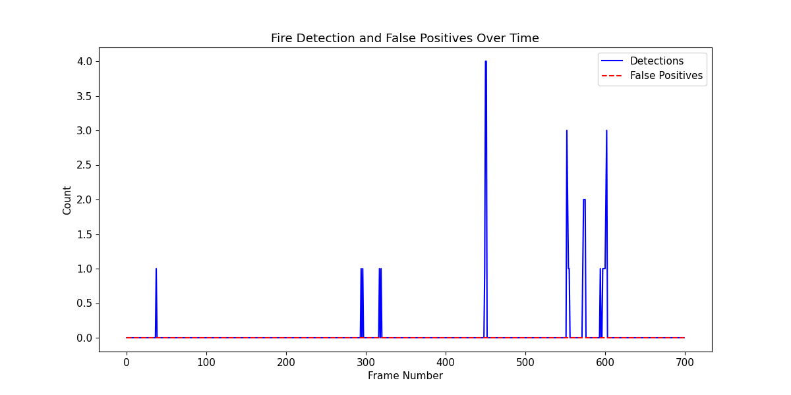

#  Fire Detection & Localization System

##  Overview

This project implements a **computer vision-based fire detection system** capable of identifying fire in images or video streams. It combines machine learning techniques with image processing to detect fire and trigger alerts.

---

##  Key Features

* Fire detection using machine learning models
*  Supports image and video input
*  Real-time detection capability
*  Visualization of detection results
*  Alert system integration (configurable)

---

##  Project Structure

```
fire-detection/
│
├── src/                     # Core source code
│   ├── main.py             # Entry point
│   ├── detect.py           # Detection logic
│   ├── alert.py            # Alert system
│   ├── utils.py            # Helper functions
│
├── config/
│   └── fire_config.yaml    # Configuration file
│
├── assets/
│   └── fire1.jpg           # Sample input
│
├── models/                 # (Download externally)
├── outputs/                # (Generated results)
│
├── requirements.txt
├── README.md
└── .gitignore
```

---

##  Installation

### 1. Clone the repository

```
git clone https://github.com/ayushpoojari3699/fire-detection.git
cd fire-detection
```

### 2. Install dependencies

```
pip install -r requirements.txt
```

---

##  Usage

### Run detection

```
python src/main.py
```

---

##  Model Weights

Due to size constraints, model files are not included in the repository.

 Download the model from:

```
(Add your Google Drive / Dropbox link here)
```

Place the file inside:

```
models/
```

---

## 📊 Sample Output



---

##  Technologies Used

* Python
* OpenCV
* NumPy / Pandas
* Machine Learning (SVM / CNN)

---

##  Notes

* Ensure model files are placed correctly before running
* Large datasets and models are excluded from this repo

---

##  Future Improvements

* Real-time webcam fire detection
* Email/SMS alert integration
* Web dashboard for monitoring
* Deployment using Flask / FastAPI

---

##  Author

**Ayush Poojari**
GitHub: https://github.com/ayushpoojari3699


